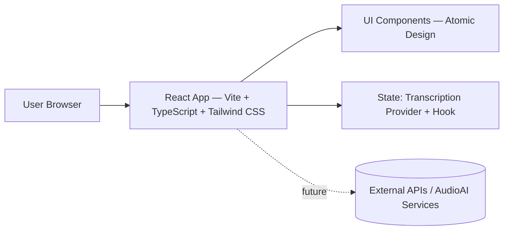
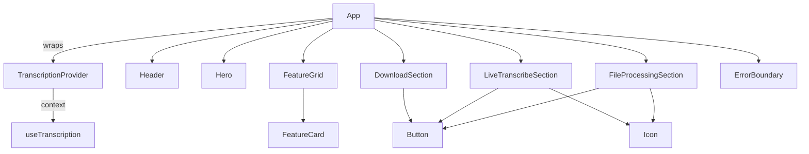
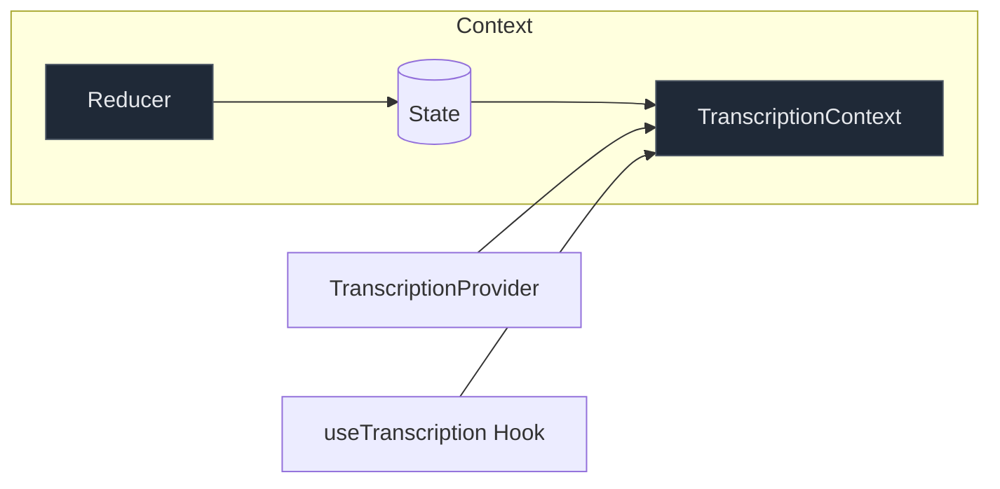
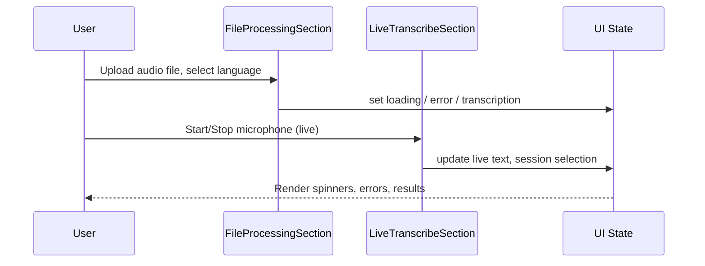

# AudioAI UI — Developer Documentation

A React + TypeScript + Vite application implementing the AudioAI marketing and interactive demo site using Atomic Design principles (atoms, molecules, organisms, templates). This document provides a complete handoff for developers.

---

## Table of Contents
1. Project Overview
2. Architecture Documentation
3. Code Structure
4. API Documentation (future-ready)
5. Development Environment Setup
6. Deployment Guide
7. Testing Information
8. Maintenance Guidelines

---

## 1) Project Overview

- Purpose and functionality:
  - Branded, accessible UI showcasing AudioAI capabilities with an interactive demo surface. The site is responsive, keyboard-accessible, and performance-oriented.
- Key features and components:
  - Header with navigation and branding
  - Hero section with primary CTA
  - Feature Grid highlighting core product areas
  - Interactive Demo section with simulated actions and error/loading states
  - ErrorBoundary for resilient UX
- Technical stack and dependencies:
  - React 19, TypeScript 5, Vite 7, Tailwind CSS 4, PostCSS/Autoprefixer, ESLint

---

## 2) Architecture Documentation

Documentation standards:
- Diagrams use Mermaid (supported in GitHub/GitLab renderers).
- Code paths are precise and relative to repo root.
- Commands and file paths are in monospace.

### System Architecture (High-Level)


### Component Relationships


State management (context + reducer):


### Data Flow


Notes:
- FeatureGrid, FileProcessingSection, LiveTranscribeSection are lazy-loaded to improve initial load.
- Tailwind utilities drive layout and design; custom animations live in src/index.css.

---

## 3) Code Structure

Root directories of interest:
- src/components/atoms: Reusable primitives (Button, Icon, etc.)
- src/components/molecules: Small composites (FeatureCard)
- src/components/organisms: Page-size sections (Header, Hero, FeatureGrid, DemoSection, ErrorBoundary)
- src/components/templates: Reserved for future page layouts
- src/assets: Static assets (if any)
- src/types: Shared TypeScript interfaces
- src/context: App state
  - `src/context/transcription.ts` (reducer, state, context)
  - `src/context/TranscriptionProvider.tsx` (provider component)
  - `src/context/useTranscription.ts` (consumer hook)

Key files:
- src/App.tsx: App shell, lazy loading, skip links, section composition
- src/index.css: Tailwind import, animations, accessibility helpers
- src/components/organisms/Header.tsx: Top navigation and external links
- src/components/organisms/Hero.tsx: Headline, description, CTAs
- src/components/organisms/FeatureGrid.tsx: Feature cards grid
- src/components/molecules/FeatureCard.tsx: Individual feature card
- src/components/organisms/FileProcessingSection.tsx: Upload & process files
- src/components/organisms/LiveTranscribeSection.tsx: Live microphone transcription
- src/components/organisms/DownloadSection.tsx: Download sessions in various formats
- src/components/organisms/ErrorBoundary.tsx: Runtime error capture
- src/context/transcription.ts: State shape, reducer, and context
- src/context/TranscriptionProvider.tsx: Provider component
- src/context/useTranscription.ts: Hook for consuming context

Module dependency highlights:
- App.tsx composes Header, Hero, FeatureGrid, FileProcessingSection, LiveTranscribeSection, DownloadSection inside ErrorBoundary
- FeatureGrid maps FeatureCard items
- The three sections use Button, Icon, ErrorMessage, LoadingSpinner where appropriate

---

## 4) API Documentation (if applicable)

Current state: Frontend-integrated API layer with three endpoints. Backend responses are handled through UI state management.

Environment:
- `VITE_API_BASE_URL` (e.g., `http://localhost:8000`)
- `VITE_WS_BASE_URL` (e.g., `ws://localhost:8000`)
- `VITE_API_TOKEN` (optional Bearer token)

Endpoints:
- `POST /file-transcribe`: Upload audio file with `language` field.
  - Client: `src/services/api/transcription.ts#transcribeFile(file, language)`
  - Response shape: `{ sessionId, transcript, translation?, status? }`
- `WebSocket /live-transcribe`: Real-time transcription stream.
  - Client: `src/services/ws/livetranscribe.ts#LiveTranscribeClient`
  - Sends binary audio frames (`MediaRecorder` chunks) and receives JSON messages `{ type, text?, sessionId? }`
  - Media detection: `MediaRecorder.isTypeSupported` guarded via runtime checks for maximum browser compatibility
- `GET /download-transcription/${session_id}?format=txt|srt|json`
  - Client: `src/services/api/transcription.ts#downloadTranscription(sessionId, format)`
  - Triggers browser download via a Blob

Error handling:
- Centralized in UI components via `ErrorMessage` and try/catch in services.
- Non-200 responses surface text payloads in thrown Errors.
  - HTTP client uses `Headers` API and safe JSON/text fallbacks.

---

## 5) Development Environment Setup

Prerequisites:
- Node.js >= 18, npm >= 9

Install:
- npm install

Run locally:
- npm run dev (serves on http://localhost:5173)

Quality tooling:
- Lint: npm run lint

Tailwind CSS:
- Tailwind v4 imported via src/index.css using @import "tailwindcss"; PostCSS pipeline configured.

Environment variables:
- Create `.env.local` for local secrets:
```
VITE_API_BASE_URL=http://localhost:8000
VITE_WS_BASE_URL=ws://localhost:8000
VITE_API_TOKEN=
```

---

## 6) Deployment Guide

Build:
- npm run build (outputs to dist/)

Preview build locally:
- npm run preview

Static hosting options:
- Netlify/Vercel/Cloudflare Pages/GitHub Pages — deploy dist/ directory

CI/CD (GitHub Actions example):
```yaml
name: build
on: [push]
jobs:
  web:
    runs-on: ubuntu-latest
    steps:
      - uses: actions/checkout@v4
      - uses: actions/setup-node@v4
        with: { node-version: 20 }
      - run: npm ci
      - run: npm run build
      - uses: actions/upload-pages-artifact@v3
        with: { path: dist }
```

---

## 7) Testing Information

Current state: No tests in repo.

Recommended stack:
- Vitest + React Testing Library + jsdom

Getting started:
- npm i -D vitest @testing-library/react @testing-library/user-event jsdom
- Add scripts:
  - "test": "vitest"
  - "test:ui": "vitest --ui"
- Example test skeleton:
```ts
import { render, screen } from '@testing-library/react'
import Hero from './Hero'

test('renders headline', () => {
  render(<Hero />)
  expect(screen.getByText(/Voice AI platform/i)).toBeInTheDocument()
})
```

Coverage:
- Enable via Vitest config flag --coverage and publish in CI for metrics.

---

## 8) Maintenance Guidelines

Common issues:
- Port 5173 in use: set PORT=5174 or stop existing dev server.
- Missing styles: ensure src/index.css imports Tailwind and PostCSS is configured.
- WebSocket auth errors: ensure `VITE_API_TOKEN` matches server expectations; token is passed via query string.

Performance considerations:
- Keep large components lazy-loaded (already in App.tsx)
- Prefer memoization for expensive child components
- Avoid unnecessary re-renders via stable props and keys

Accessibility:
- Maintain focus styles and keyboard nav (skip links present)
- Use semantic elements and ARIA labels where needed
 - Mobile menu links are placeholders; navigation is prevented until a router is introduced.

Scaling recommendations:
- Continue Atomic Design discipline as features grow
- Extract feature-specific state into hooks as complexity increases
- Introduce API layer and caching (e.g., React Query) when integrating real services

New Components & Architecture (added/refined):
- `FileProcessingSection`: Upload & process audio, language select, progress & status
- `LiveTranscribeSection`: Microphone controls, WebSocket live text display, language toggle
- `DownloadSection`: Session history, format selection, download triggers
- `TranscriptionProvider` + `useTranscription` + `transcription.ts`: Centralized session & language state management
- API client utilities: `src/services/api/client.ts`

Usage:
- The App composes the three sections under a single demo area and wraps everything in `TranscriptionProvider` for shared state.

Changelog highlights:
- Refactor: Split context into `transcription.ts` (state/reducer/context), `TranscriptionProvider.tsx` (component), `useTranscription.ts` (hook) for compliance with `react-refresh/only-export-components` and clearer separation.
- Hygiene: Removed committed build artifacts and unused assets; added `build` to .gitignore.
- Robustness: Safer `MediaRecorder` type detection; improved error typing (`unknown` catch guards); `Headers` API usage in HTTP client.

---

Changelog highlights:
- Rebranded to AudioAI (logo text, title)
- Contrast and spacing improvements (Hero and sections use consistent py-4)
