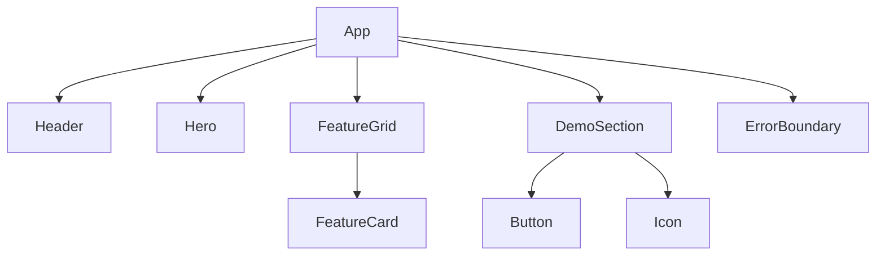
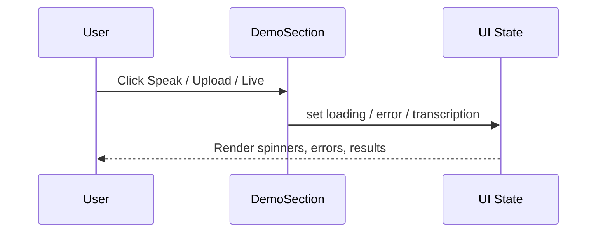

# AudioAI UI — Developer Documentation

A React + TypeScript + Vite application implementing the AudioAI marketing and interactive demo site using Atomic Design principles (atoms, molecules, organisms, templates). This document provides a complete handoff for developers.

---

## Table of Contents
1. Project Overview
2. Architecture Documentation
3. Code Structure
4. API Documentation (future-ready)
5. Development Environment Setup
6. Deployment Guide
7. Testing Information
8. Maintenance Guidelines

---

## 1) Project Overview

- Purpose and functionality:
  - Branded, accessible UI showcasing AudioAI capabilities with an interactive demo surface. The site is responsive, keyboard-accessible, and performance-oriented.
- Key features and components:
  - Header with navigation and branding
  - Hero section with primary CTA
  - Feature Grid highlighting core product areas
  - Interactive Demo section with simulated actions and error/loading states
  - ErrorBoundary for resilient UX
- Technical stack and dependencies:
  - React 19, TypeScript 5, Vite 7, Tailwind CSS 4, PostCSS/Autoprefixer, ESLint

---

## 2) Architecture Documentation

### System Architecture (High-Level)
```mermaid
flowchart LR
  A[User Browser] --> B[React App (Vite, TS, Tailwind)]
  B --> C[UI Components (Atomic Design)]
  B -. future .-> D[(External APIs / AudioAI Services)]
```

### Component Relationships


### Data Flow


Notes:
- FeatureGrid and DemoSection are lazy-loaded to improve initial load.
- Tailwind utilities drive layout and design; custom animations live in src/index.css.

---

## 3) Code Structure

Root directories of interest:
- src/components/atoms: Reusable primitives (Button, Icon, etc.)
- src/components/molecules: Small composites (FeatureCard)
- src/components/organisms: Page-size sections (Header, Hero, FeatureGrid, DemoSection, ErrorBoundary)
- src/components/templates: Reserved for future page layouts
- src/assets: Static assets (if any)
- src/types: Shared TypeScript interfaces

Key files:
- src/App.tsx: App shell, lazy loading, skip links, section composition
- src/index.css: Tailwind import, animations, accessibility helpers
- src/components/organisms/Header.tsx: Top navigation and external links
- src/components/organisms/Hero.tsx: Headline, description, CTAs
- src/components/organisms/FeatureGrid.tsx: Feature cards grid
- src/components/molecules/FeatureCard.tsx: Individual feature card
- src/components/organisms/DemoSection.tsx: Interactive demo surface
- src/components/organisms/ErrorBoundary.tsx: Runtime error capture

Module dependency highlights:
- App.tsx composes Header, Hero, FeatureGrid, DemoSection inside ErrorBoundary
- FeatureGrid maps FeatureCard items
- DemoSection uses Button, Icon, ErrorMessage, LoadingSpinner

---

## 4) API Documentation (if applicable)

Current state: No live API integration. DemoSection simulates async behavior for UX flows.

Future integration template:
- Base URL via Vite env (e.g., VITE_API_BASE_URL)
- Example fetch wrapper:
```ts
async function getTranscription(file: File) {
  const base = import.meta.env.VITE_API_BASE_URL;
  const form = new FormData();
  form.append('file', file);
  const res = await fetch(`${base}/transcribe`, { method: 'POST', body: form });
  if (!res.ok) throw new Error(await res.text());
  return res.json();
}
```
- Auth: Recommend Bearer token via VITE_API_TOKEN with secure handling (never commit).

---

## 5) Development Environment Setup

Prerequisites:
- Node.js >= 18, npm >= 9

Install:
- npm install

Run locally:
- npm run dev (serves on http://localhost:5173)

Quality tooling:
- Lint: npm run lint

Tailwind CSS:
- Tailwind v4 imported via src/index.css using @import "tailwindcss"; PostCSS pipeline configured.

Environment variables:
- Create .env.local for local secrets when APIs are added, e.g.:
```
VITE_API_BASE_URL=https://api.example.com
VITE_API_TOKEN=...
```

---

## 6) Deployment Guide

Build:
- npm run build (outputs to dist/)

Preview build locally:
- npm run preview

Static hosting options:
- Netlify/Vercel/Cloudflare Pages/GitHub Pages — deploy dist/ directory

CI/CD (GitHub Actions example):
```yaml
name: build
on: [push]
jobs:
  web:
    runs-on: ubuntu-latest
    steps:
      - uses: actions/checkout@v4
      - uses: actions/setup-node@v4
        with: { node-version: 20 }
      - run: npm ci
      - run: npm run build
      - uses: actions/upload-pages-artifact@v3
        with: { path: dist }
```

---

## 7) Testing Information

Current state: No tests in repo.

Recommended stack:
- Vitest + React Testing Library + jsdom

Getting started:
- npm i -D vitest @testing-library/react @testing-library/user-event jsdom
- Add scripts:
  - "test": "vitest"
  - "test:ui": "vitest --ui"
- Example test skeleton:
```ts
import { render, screen } from '@testing-library/react'
import Hero from './Hero'

test('renders headline', () => {
  render(<Hero />)
  expect(screen.getByText(/Voice AI platform/i)).toBeInTheDocument()
})
```

Coverage:
- Enable via Vitest config flag --coverage and publish in CI for metrics.

---

## 8) Maintenance Guidelines

Common issues:
- Port 5173 in use: set PORT=5174 or stop existing dev server.
- Missing styles: ensure src/index.css imports Tailwind and PostCSS is configured.

Performance considerations:
- Keep large components lazy-loaded (already in App.tsx)
- Prefer memoization for expensive child components
- Avoid unnecessary re-renders via stable props and keys

Accessibility:
- Maintain focus styles and keyboard nav (skip links present)
- Use semantic elements and ARIA labels where needed

Scaling recommendations:
- Continue Atomic Design discipline as features grow
- Extract feature-specific state into hooks as complexity increases
- Introduce API layer and caching (e.g., React Query) when integrating real services

---

Changelog highlights:
- Rebranded to AudioAI (logo text, title)
- Contrast and spacing improvements (Hero and sections use consistent py-4)
